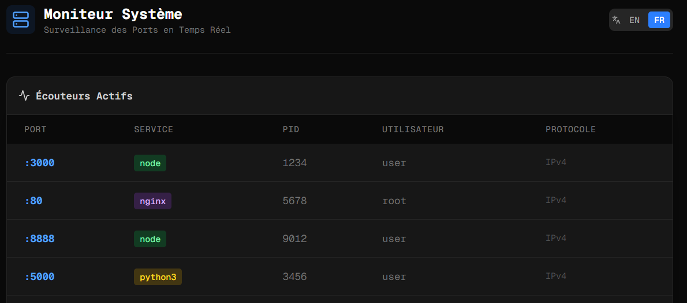

# 🎛️ Admin Dashboard


> **"Attends, le port 3000 est déjà pris ou pas ?"**

## 📖 L'Histoire

Je gère un VPS Hetzner sur lequel je déploie de nombreux projets : backends Node.js, scripts Python, frontends Next.js et conteneurs Docker. Avec l'accumulation des services, c'était devenu le chaos. Je perdais du temps à me connecter en SSH juste pour lancer un `netstat` ou pour transférer un fichier de config depuis mon téléphone.

**Ce projet est ma solution.**

J'ai construit ce Panel Admin centralisé comme un "Couteau Suisse" pour mon serveur. L'objectif n'est pas de remplacer Grafana, mais d'avoir un dashboard léger, agréable et extensible pour les tâches quotidiennes.

## 🏗️ Philosophie & Architecture

L'approche est minimaliste : **Zéro dépendance sur l'hôte**.
Le dashboard effectue ses propres vérifications système en utilisant les commandes Linux standards et le système de fichiers natif.

L'architecture est modulaire (Next.js App Router), permettant d'ajouter des "briques" de fonctionnalités isolées.

## ✨ Modules & Fonctionnalités

### 1. 📡 Live Port Monitor
Pour ne plus jamais avoir d'erreurs `EADDRINUSE`.
- **Temps Réel** : Rafraîchissement automatique (SWR polling).
- **Deep Scan** : Identification du Processus (PID), de l'Utilisateur et du Protocole (IPv4/IPv6).
- **Sécurité** : Parsing strict de la commande `lsof` (pas d'accès shell direct).

### 2. ☁️ Transit Zone
Un cloud personnel éphémère pour transférer des fichiers entre mes appareils (Tel <-> PC <-> Serveur).
- **Smart Upload** : Drag & Drop fluide.
- **Disk Guard** : Vérifie l'espace disque avant upload (bloque si < 5GB libres).
- **Auto-Destruction** : Les fichiers sont supprimés automatiquement après 24h (sauf si marqués "Persistants").
- **Téléchargement Sécurisé** : Stream de fichiers via API authentifiée (pas d'accès public direct).

### 3. 📋 Clipboard
Stockage temporaire de texte avec historique pour synchroniser du contenu entre appareils.
- **Historique** : Jusqu'à 50 éléments récents.
- **Copie Rapide** : Un clic pour copier dans le presse-papier.
- **Interface Simple** : Textarea pour coller ou taper du texte.



## 🛡️ Sécurité

Comme ce dashboard expose des infos système, la sécurité est la priorité absolue.

1.  **Authentification** : Protégé par un **Middleware Basic Auth**. Pas de base de données, tout est dans `.env.local`.
2.  **Isolation** : L'interface ne parle jamais au shell directement pour les entrées utilisateur.
3.  **File Safety** : Les uploads sont stockés hors du dossier public web pour éviter l'exécution de scripts malveillants.

## 🚀 Démarrage

### 1. Prérequis
Le serveur doit avoir `lsof` installé :
```bash
sudo apt-get install lsof
```

### 2. Installation

```bash
git clone https://github.com/votre-user/admin-dashboard.git
cd admin-dashboard
npm install
```

### 3. Configuration

Créez un fichier `.env.local`. **Ne commitez pas ce fichier.**

```env
DASHBOARD_USER=admin
DASHBOARD_PWD=votre_mot_de_passe_robuste
PORT=8888
```

### 4. Automatisation (Cron)

Pour le nettoyage automatique des fichiers temporaires :

```bash
# Dans crontab -e
0 * * * * curl -u admin:password http://localhost:8888/api/cron/cleanup
```

### 5. Déploiement (PM2)

```bash
npm run build
pm2 start ecosystem.config.js
```

## ⚠️ Note sur les Permissions

Le dashboard tourne avec les privilèges de l'utilisateur qui lance le processus Node.js.

* Lancé en `root` : Il voit tous les ports et tous les fichiers.
* Lancé en utilisateur standard (recommandé) : Il voit uniquement ses propres processus.

---

*Développé par Chhaju*
